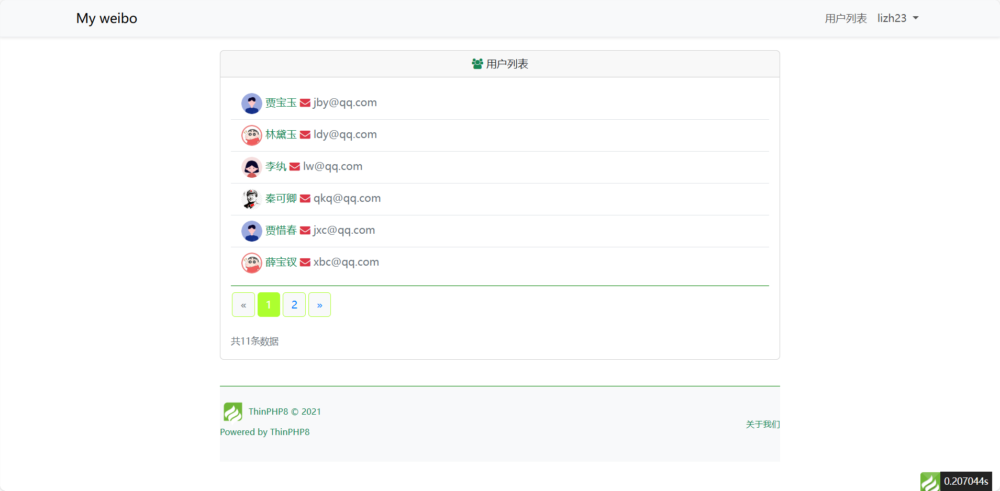

# 博文管理系统

一个简单的博文管理系统，基于 **ThinkPHP 8.x** 和 **MySQL** 构建，支持用户注册、登录、博文管理等功能。

---

## 功能特性

- **用户管理**：支持用户注册、登录、个人资料编辑。
- **博文管理**：支持博文的创建、编辑、删除。
- **邮箱验证**：注册后发送激活邮件，支持密码重置功能。
- **分页显示**：用户列表和博文列表支持分页。
- **响应式设计**：适配不同设备，提供良好的用户体验。

---

## 技术栈

- **后端框架**：ThinkPHP 8.x
- **数据库**：MySQL
- **邮件服务**：PHPMailer
- **前端框架**：Bootstrap
- **其他工具**：Composer

---

## 安装步骤

### 1. 克隆项目
```bash
git clone https://github.com/your-repo/your-project.git
cd your-project
```

### 2. 配置环境
复制 `.env` 文件并填写相关配置：
```plaintext
APP_DEBUG = true

DB_TYPE = mysql
DB_HOST = localhost
DB_NAME = tp
DB_USER = root
DB_PASS = root
DB_PORT = 3306
DB_CHARSET = utf8
DB_PREFIX = tp_

EMAIL_HOST = smtp.qq.com
EMAIL_USERNAME = your-email@example.com
EMAIL_PASSWORD = your-email-password
```

### 3. 安装依赖
确保已安装 Composer，运行以下命令安装依赖：
```bash
composer install
```

### 4. 导入数据库
将项目中的 `tp.sql` 文件导入到你的 MySQL 数据库中。

### 5. 启动项目
运行以下命令启动内置服务器：
```bash
php think run
```
访问 [http://localhost:8000](http://localhost:8000) 查看项目。

---

## 文件结构

```
├── app/                # 应用核心代码
│   ├── controller/     # 控制器
│   ├── model/          # 数据模型
│   ├── view/           # 视图文件
├── config/             # 配置文件
├── public/             # 公共资源文件
├── route/              # 路由定义
├── runtime/            # 运行时文件
├── vendor/             # Composer 依赖
├── .env                # 环境配置文件
├── composer.json       # Composer 配置文件
├── README.md           # 项目说明文件
```

---

## 截图展示

### 用户列表


### 用户个人资料编辑


---

## 许可证

本项目遵循 [Apache 2.0 开源协议](http://www.apache.org/licenses/LICENSE-2.0)。

---

## 联系我们

如有问题或建议，请联系开发者：
- **邮箱**：lizheng2038@foxmail.com
- **GitHub**：[your-repo](https://github.com/your-repo)
```
用户列表
用户列表

用户个人资料编辑
用户个人资料编辑

许可证
本项目遵循 Apache 2.0 开源协议。

联系我们
如有问题或建议，请联系开发者：

邮箱：lizheng2038@foxmail.com
GitHub：your-repo

## 许可证

本项目采用 MIT 许可证，详情见 [LICENSE](LICENSE) 文件。


